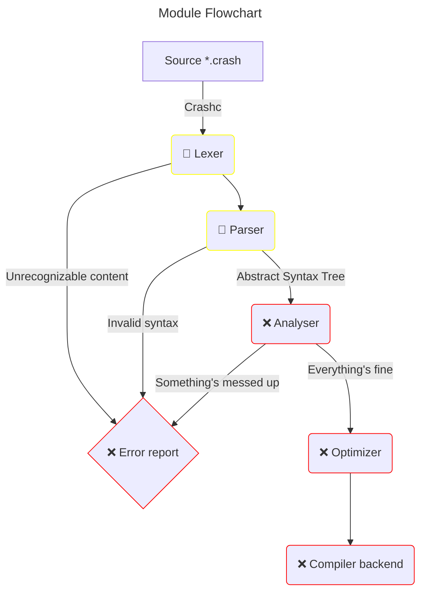

# Crash Compiler
**The compiler is the heart of every language.**
Until we're not able to program or run any compiler in Crash itself,
we will continue writing the Crash Compiler in Rust.

#### State Declaration

Crash is a completely new language, so we have a lot of work to do, before
we can run the first programs with it.

These Symbols and their colors show the current state of some feature.

- (✅) This feature is fully implemented and it's working flawless
- (🚧) We're making progress on implementing this feature; Don't expect it to function the way it should
- (❌) This feature is not implemented yet

### Compiler Targets
Following targets are planned to be supported.
There may be more in the future.

| Architecture | Status | More |
|--------------|--------|------|
| x86 (64)     | ❌      |      |
| ARM          | ❌      |      |

### Flowchart
Here a quick flowchart of how your code slides through all Crashc-modules.

