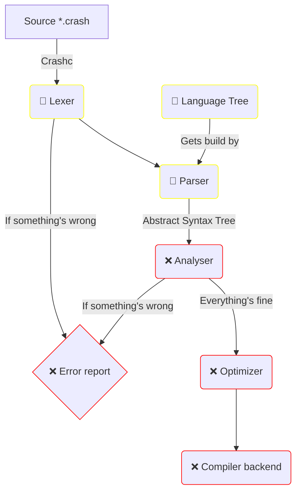

# Crash Compiler

The compiler is the heart of the every language.
Until we're not able to program and run any compiler in Crash itself,
we will continue writing the Crash Compiler in Rust.

#### State Declaration

Crash is a completely new language. So we have a lot of work to do, before
we can run the first programs innit.

These Symbols and their colors show the current state of everything, 
that should work in the future.

- (❌) This feature is not implemented yet
- (🚧) Feature is in progress and may already be implemented; Don't expect it to function the way it should
- (✅) This feature is fully implemented and working flawless

### Compiler Targets
Following targets are planned to be supported.
There may be more in the future.

| Architecture | Status | More |
|--------------|--------|------|
| x86 (64)     | ❌      |      |
| ARM          | ❌      |      |

### Flowchart
Here a quick flowchart of how your code slides through all Crashc-modules.

